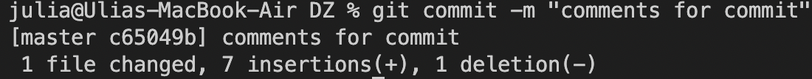
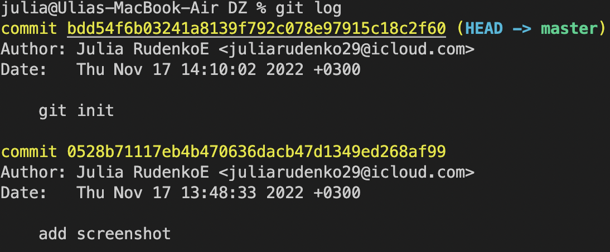
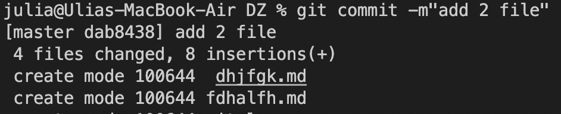

# Команды Git

## Git : ##
* самая популярная система контроля верций 

* главная фишка в том, что *Git* не хранит файлы целиком, а только отличия между ними, что позволяет экономить память

>  *Линус Торвальдс -*  Финно-американский программист, создатель операционной системы *Linux*, создатель *Git*.
________

## Комманды Git: ##
-------
* *"git --version"* -проверка текущей установленной версии программы

-------------
* *"git init"* -команда инициализации, после которой программа начнет отслеживать действия
--------
* *"git status"* - показывает текущее состояние гита, есть ли изменения, которые нужно сохранить 

 

-------

* *"git add"* - добавляет содержимое рабочего каталога в индекс для последующего коммита (дается только после дополнения файлов)

*** 

* *git commit -m"second"*- фиксирует и сохраняет добавленные изменения

_______

* *git commit -am"second"* - объединяет функции          
*git add* и *git commit*, удобнее использовать ее
-------
  
  * *"git log"* - журнал изменений, колличество сохранений с индивидуальным номером и коментарием к коммиту

  
  _________

* *"git checkout"* -  переключение между версиями

>Для работы нужно указать не только интересующий коммит, но и вернуться в исходное состояние при помощи команда *git chckout master* 
----------
* *"git add_."* - используется, когда нужно применить функцию *git add* для нескольких файлов. После нее нужно использовать функцию *git commit -m" "*

-----------
* *"git rm"* - удалить файл (указываем название файла)
--------
* *"git log -p"*- показывает все изменения
---------
* *"git diff ____ ____"* -показывает разницу между двумя коммитами. Необходимо ввести первые 4 символа от каждого коммита.
_________

